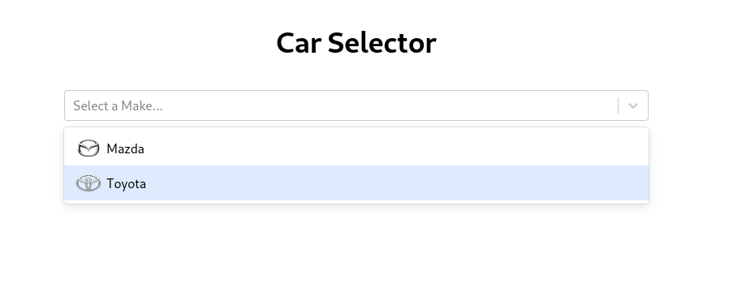

# Vehicle Selector

A modern example of a car selector system; one that you'd expect to find on car sale site. Originally built on Flask, I have reworked the application to now use FastAPI. We're still using SQLAlchemy, but in the 2.0 dialect! The application uses a pure React frontend to fetch data from our server and display it appropriately. Furthermore, the solution has been further refactored to now deploy with Docker compose for easy devops. For this, I have configured Nginx as our webserver and supplied a basic configuration that does NOT support HTTPS.


## Major Changes
* Removed NextJS - only implementing pure React with Typescript and Tailwind
* Added containerisation with Docker Compose...
  * Services; api, frontend and MySQL database. The frontend service is a multi-stage build of both the React app and an nginx webserver.
  * Automated startup scripts builds database & imports basic master data
  * API written with FastAPI - asynchronous routing, database handling & file IO
  * Docker compose secrets used to pass passwords to containers
  * Basic nginx configuration provided.
* Vehicle make logos also served by Nginx
* Production database CRUD pattern




## Vehicles Dataset
The dataset in use is my own, was hard to compile and is enormous. Therefore, I have provided a small slice for demonstration purposes. The set contains types, makes, models, year models and optioned specifics in cascading order. Find this [here](data/master/vehicles.json).


### This set contains all options for all year models in the following models:
* ### Toyota
  * #### 86
  * #### Chaser
  * #### MR2
  * #### Supra
* ### Mazda
  * #### 6
  * #### MX-5
  * #### RX-7


## Installation (Docker Compose)
```
# Clone the repo.
$ git clone https://github.com/Ald0s/Car-Selector-Backend.git
$ cd Car-Selector-Backend/

# Create passwords for database.
$ mkdir database/secrets/
$ python -c "import secrets; print(secrets.token_hex())" > database/secrets/db_password.txt
$ python -c "import secrets; print(secrets.token_hex())" > database/secrets/db_root_password.txt

# Build with docker compose.
$ docker compose build

# Run.
$ docker compose up

# View the project at:
http://localhost/
```


## Python packages
* fastapi
* pydantic
* sqlalchemy
* gunicorn
* aiofiles
* aiomysql
* aiosqlite
* uvicorn[standard]
* pytest
* httpx
* fastapi-pagination


## Authors
* **Alden Viljoen**